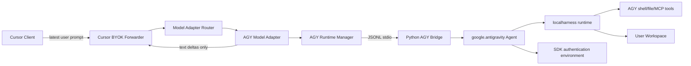
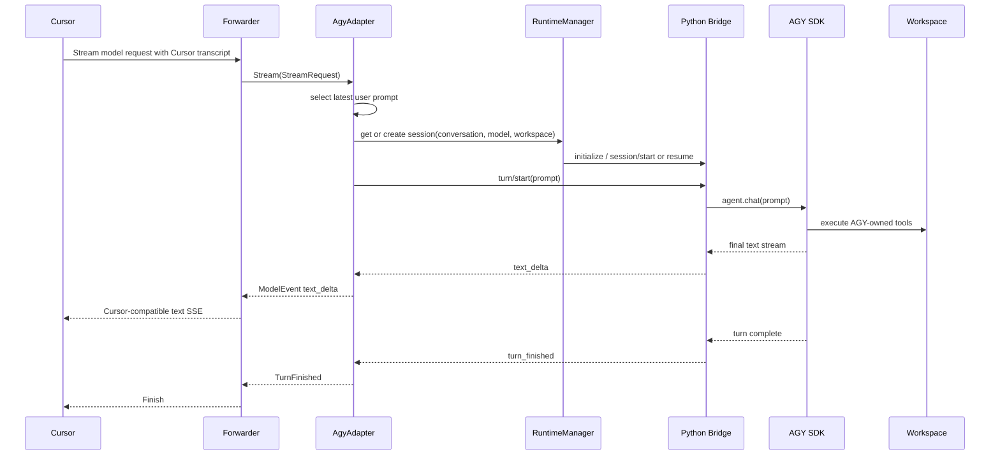
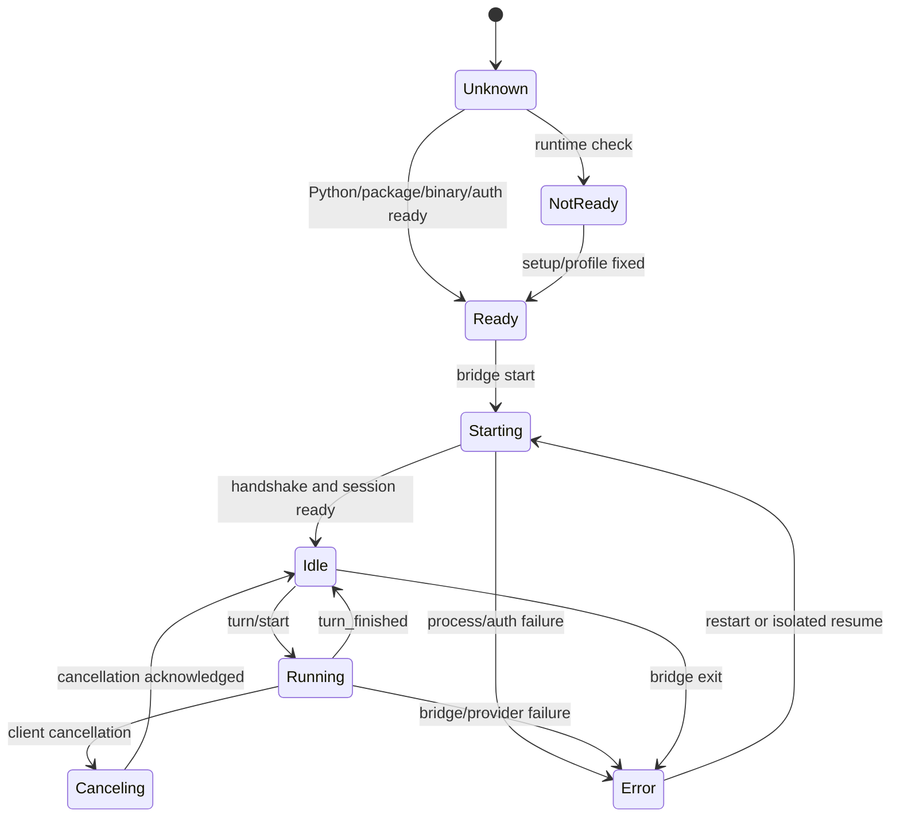
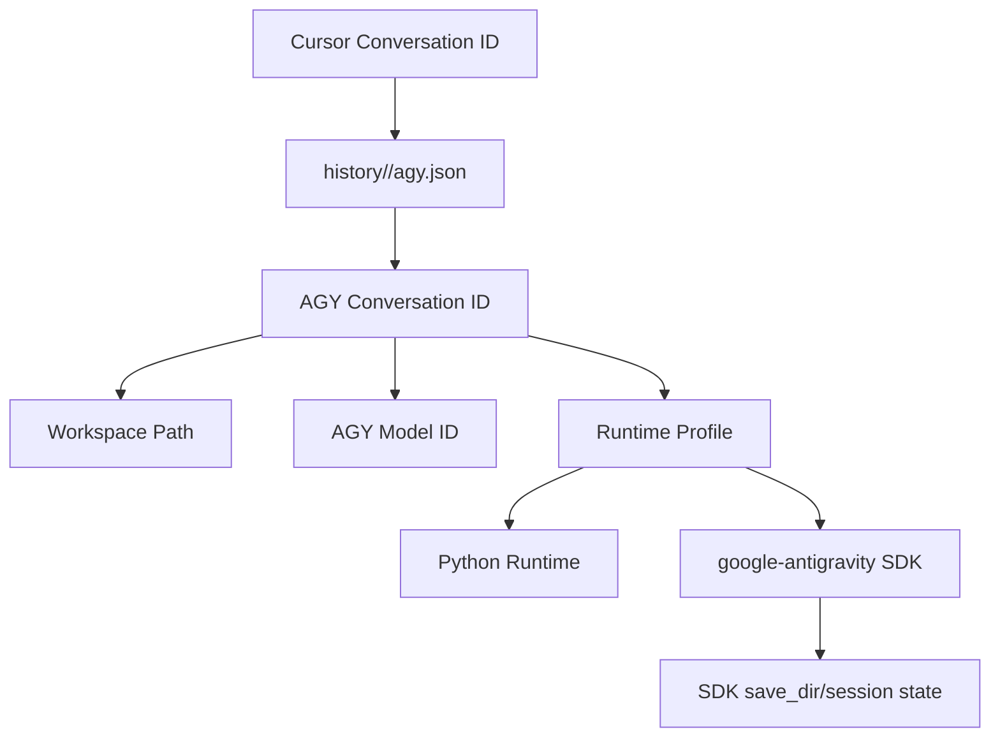
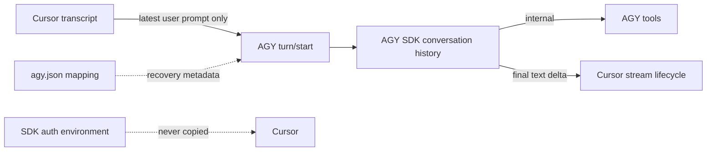
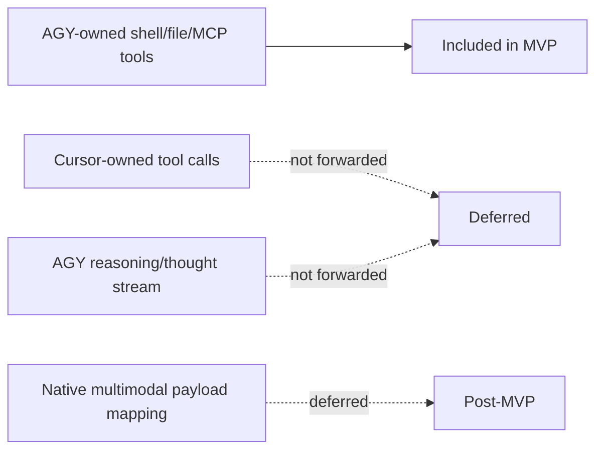

# AGY adapter architecture

## Component diagram

The Go adapter remains responsible for Cursor's provider lifecycle. The Python
bridge is responsible for translating the narrow prompt/text contract into the
Antigravity SDK's async agent API. AGY remains the only owner of its tools and
agent loop.

## Request sequence

Tool calls, tool results and internal thoughts stay between the SDK and AGY
runtime. They must not enter Cursor's `context.json`, provider replay or
pending-tool state.

## Runtime state machine

The runtime manager serializes turns for each session. A bridge process exit
must fail the active turn, close the current provider pass and prevent late
text events from being attached to a later Cursor turn.

## Conversation/session mapping

The mapping is conversation-owned. The adapter must pass a stable AGY session
identity to the bridge and use the same workspace on resume. If the current
Cursor request does not provide a usable workspace or conversation identity,
the adapter must fail clearly or use an explicitly configured fallback; it must
not silently merge unrelated conversations.

## Data boundaries

`state.json` and `context.json` remain the Cursor forwarder's recovery truth,
but AGY tool activity is not appended there as Cursor tool activity. The
`agy.json` mapping only connects the two session identities and does not become
part of the model prompt.

## Failure and cancellation boundaries

- A provider error from the SDK becomes one sanitized `ProviderError`; raw
  traceback and credentials stay on redacted stderr.
- Cancellation propagates from the Go request context to `turn/cancel`, then to
  the SDK response and its internal tool work.
- Text arriving after cancellation, `[DONE]` or a failed provider pass is
  discarded by pass/session identity.
- A resume failure creates a new AGY session mapping; it never reuses an
  uncertain session with a different workspace or model.
- AGY-owned tool failures remain inside the AGY turn unless the SDK terminates
  the turn with an error. Cursor should see only the resulting text or final
  provider error.

## MVP boundary

The key invariant is one owner for the agent loop: AGY receives the prompt and
performs its own work; Cursor displays the resulting text stream and does not
attempt to execute or approve AGY tools.
