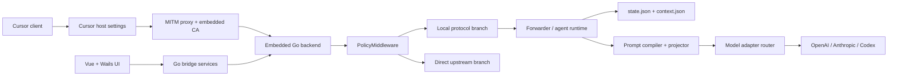
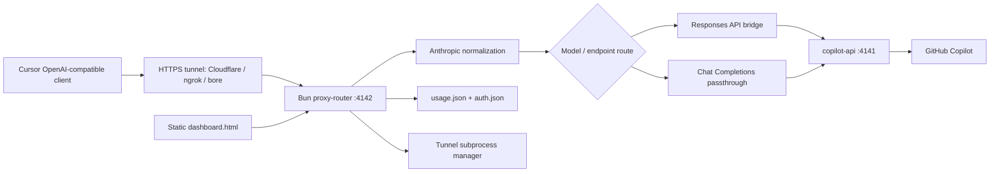

# So sánh kiến trúc `cursor-byok` và `copilot-for-cursor`

## 1. Kết luận ngắn

Hai codebase cùng giải quyết một bài toán bề mặt giống nhau: đưa model/provider bên ngoài vào Cursor qua một lớp compatibility gateway. Tuy nhiên, chúng nằm ở hai tầng kiến trúc khác nhau:

- `cursor-byok` là một desktop runtime hoàn chỉnh: Wails/Vue ở phía UI, Go ở backend, MITM proxy để điều khiển traffic của Cursor, local protocol protobuf/Connect, agent state machine, persistence và provider adapters.
- `submodules/copilot-for-cursor` là một HTTP proxy chuyên biệt: Bun/TypeScript nhận OpenAI-compatible requests, chuyển đổi Anthropic → OpenAI, bridge Responses API, forward sang `copilot-api`, rồi cung cấp dashboard/tunnel để người dùng kết nối Cursor.

Vì vậy, hai repo có tính bổ sung nhiều hơn là thay thế trực tiếp. Repo chính mạnh ở tính toàn vẹn của runtime, state, tool orchestration và khả năng mở rộng provider. Subtree mạnh ở sự nhỏ gọn, tốc độ triển khai và trải nghiệm “một lệnh chạy proxy + dashboard + tunnel”.

Khuyến nghị: giữ subtree là một adapter/process tùy chọn ở ranh giới OpenAI-compatible, không copy nguyên `proxy-router.ts` vào `internal/backend/forwarder`. Nếu cần tích hợp Copilot vào sản phẩm chính, hãy quản lý subtree như một upstream provider riêng, pin dependency/version, bổ sung health check và khóa bảo mật trước khi bật tunnel hoặc expose ra ngoài.

## 2. Phạm vi và bằng chứng

Phân tích này dựa trên code đã có trong working tree tại ngày 2026-08-03:

| Hạng mục | Bằng chứng |
|---|---|
| Repo chính | `cursor-byok`, `HEAD=5c8663dff` |
| Subtree source | `3a4a9232b9a7679ba79af3829157d0a11d7ea0f1` |
| Commit subtree trong repo chính | `5c8663dff`, parent squash `673661f2e4946e3ff00308d21b3caab3ff5fb4d7` |
| Backend architecture hiện tại | [`internal/backend/README.md`](../internal/backend/README.md) |
| Desktop startup/lifecycle | [`main.go`](../main.go), [`internal/app/runner.go`](../internal/app/runner.go), [`internal/client/lifecycle.go`](../internal/client/lifecycle.go) |
| Protocol local của Cursor | [`proto/agent_v1.proto`](../proto/agent_v1.proto), [`proto/aiserver_v1.proto`](../proto/aiserver_v1.proto) |
| Subtree entrypoint | [`start.ts`](../submodules/copilot-for-cursor/start.ts), [`proxy-router.ts`](../submodules/copilot-for-cursor/proxy-router.ts) |
| Subtree model conversion | [`anthropic-transforms.ts`](../submodules/copilot-for-cursor/anthropic-transforms.ts), [`responses-bridge.ts`](../submodules/copilot-for-cursor/responses-bridge.ts) |

Inventory chỉ đếm source/config đang được quan tâm, không tính `node_modules`, generated assets hoặc binary:

- Repo chính: 185 file Go trong `internal/` với khoảng 49.564 dòng và 33 file source frontend với khoảng 6.087 dòng.
- Subtree: 26 file được track, trong đó 19 file code/config với khoảng 3.581 dòng; TypeScript/JavaScript chiếm 15 file và khoảng 2.235 dòng.
- Test: repo chính có 10 file `*_test.go` trong `internal/`; subtree hiện có 1 file test với 5 test case, tập trung vào Anthropic request normalization.

Một lưu ý về provenance: commit source là commit của Jackson Kasi và có message merge `CharlesYWL/main`; `package.json` trỏ repository về `CharlesYWL/copilot-for-cursor`, còn README mô tả nó là fork của `jacksonkasi1/copilot-for-cursor`. Báo cáo này đánh giá đúng tree đang được import, không giả định rằng nó là một bản upstream nguyên bản không có fork-specific changes.

## 3. Kiến trúc repo chính: `cursor-byok`

### 3.1 Hình thái sản phẩm

Repo chính là một ứng dụng desktop đa nền tảng tên “Cursor Helper”:

1. `main.go` embed `frontend/dist` và asset/icon vào binary Go.
2. `internal/app/runner.go` khởi tạo Wails application, CA certificate manager, MITM proxy, bridge services, metrics, ads và updater.
3. `internal/client/ProxyService` điều phối lifecycle của embedded backend và MITM proxy.
4. UI Vue gọi các Go service qua Wails bindings; người dùng cấu hình model adapter, proxy state, metrics và các chức năng hỗ trợ từ desktop app.



### 3.2 Protocol và request flow

Backend không chỉ nhận một JSON chat endpoint. Nó tái hiện các surface mà local Cursor client sử dụng:

- `BidiAppend` nhận `BidiAppendRequest`, giải mã payload hex thành `AgentClientMessage` protobuf trong [`internal/backend/agent/protocol/inbound.go`](../internal/backend/agent/protocol/inbound.go), sau đó map message thành command của runtime.
- `RunSSE` stream `AgentServerMessage` ngược về Cursor.
- Các service khác gồm AI, repository index, documentation upload, dashboard và các route compatibility của Cursor.
- `server.PolicyMiddleware` quyết định local branch hay direct upstream branch dựa trên routing mode và `X-Server-Upstream-URL`.

Điểm quan trọng là protocol local phân biệt rõ request downstream cần phản hồi (`exec_server_message`, `interaction_query`) với notification (`interaction_update`, checkpoint). Đây là một contract stateful, không phải chỉ là request/response translation đơn giản.

### 3.3 Agent runtime và state machine

`internal/backend/forwarder` là trung tâm runtime. Một request có `ActiveStream`, được quản lý bởi `StreamBroker` và một actor mailbox trong [`actor.go`](../internal/backend/forwarder/actor.go). State theo dõi nhiều loại trạng thái đồng thời:

- provider pass và `model_call_id`;
- pending exec và pending interaction;
- stream subscriber/backlog/cursor;
- partial tool calls, tool result và late result;
- foreground/background shell;
- manual/automatic compaction;
- provider cancellation, idle timeout và terminal state;
- subagent model override, plan/todo và MCP metadata.

`Service` nhận client intent, cập nhật conversation, drive provider stream, phát event về broker và resume provider khi tool result tới. Đây là lý do repo chính có thể giữ semantics của Plan mode, Agent mode, tool calls, interaction và subagent thay vì chỉ chuyển tiếp text.

### 3.4 Persistence và prompt compilation

Conversation được lưu trong hai fact store chính:

- `state.json`: trạng thái loop hiện tại, current plan/todo, sequence, provider call, compaction và runtime metadata.
- `context.json`: các semantic history entries append-only được projector dùng để tái tạo prompt.

[`file_store.go`](../internal/backend/forwarder/file_store.go) có conversation lock, sequence assignment và atomic write/replace. [`projector.go`](../internal/backend/forwarder/projector.go) dựng lại model messages từ history. [`compiler.go`](../internal/backend/forwarder/compiler.go) ghép prompt asset, replay, tool catalog, user rules và reminder thành `CompiledConversation`, đồng thời tính `StableMessageCount` cho provider cache.

Đây là điểm khác biệt kiến trúc lớn nhất với subtree: repo chính coi conversation và recovery là dữ liệu sản phẩm; subtree coi request body là dữ liệu tạm của một lần proxy.

### 3.5 Provider abstraction

[`internal/backend/agent/model/router.go`](../internal/backend/agent/model/router.go) resolve channel theo config rồi chọn adapter:

- OpenAI-compatible: Chat Completions hoặc Responses API;
- Anthropic Messages;
- Codex app-server.

Các adapter chuẩn hóa message/tool/reasoning, xử lý stream SSE, retry, idle watchdog, provider limits, cache frontier, reasoning signature và LLM artifacts. Config hỗ trợ nhiều model adapter, endpoint shape, custom headers, extra params, thinking effort, context window và token limits.

### 3.6 Build và vận hành

Repo chính đóng gói thành binary/app native theo platform bằng Wails, Go và frontend build. `ProxyService.StartProxy` thực hiện chuỗi startup có health check: start backend → chờ backend ready → build/start MITM proxy → inject Cursor settings. Khi stop/quit, app dừng proxy, clear settings và stop backend.

Cách này làm runtime nặng hơn nhưng cho phép kiểm soát lifecycle, loopback binding, persistence, logs và giao diện trong cùng một sản phẩm.

## 4. Kiến trúc subtree: `copilot-for-cursor`

### 4.1 Hình thái sản phẩm

Subtree là một service proxy độc lập chạy bằng Bun. [`start.ts`](../submodules/copilot-for-cursor/start.ts) điều phối hai process:

1. Nếu port 4141 chưa có service, spawn `npx @jeffreycao/copilot-api@latest start`.
2. Chờ `copilot-api` trả `/v1/models`.
3. Import [`proxy-router.ts`](../submodules/copilot-for-cursor/proxy-router.ts), chạy Bun server ở port 4142.
4. Người dùng cấu hình Cursor trỏ tới `https://<tunnel>/v1` và dùng model có prefix `cus-`.



Không có embedded Cursor local protocol hoặc native desktop shell. Cursor phải được cấu hình thủ công như một OpenAI-compatible model endpoint; HTTPS tunnel là một phần của quick-start khi Cursor yêu cầu endpoint HTTPS.

### 4.2 Routing và conversion

`proxy-router.ts` vừa là HTTP server vừa là control plane:

- `/` và `/dashboard.html`: static dashboard;
- `/api/usage`, `/api/logs/*`, `/api/keys/*`, `/api/tunnel/*`: dashboard APIs;
- `/api/models`: lấy model list từ upstream và thêm prefix `cus-`;
- `/v1/*`: optional API key auth rồi proxy sang `http://localhost:4141`.

Với `POST .../chat/completions`, pipeline là:

1. log request;
2. bỏ prefix `cus-` khỏi model id;
3. `normalizeRequest` đổi system field, stop fields, tools, tool choice, assistant `tool_use` và user `tool_result` sang shape OpenAI;
4. `compactIfNeeded` kiểm tra token estimate và có thể summary/truncate;
5. model GPT-5/Responses được đưa qua `handleResponsesAPIBridge`;
6. request còn lại được forward tới `copilot-api`;
7. response stream được pass-through hoặc convert Responses SSE về Chat Completions SSE.

Các module chức năng chính được README subtree liệt kê trong [`submodules/copilot-for-cursor/README.md`](../submodules/copilot-for-cursor/README.md): `anthropic-transforms.ts`, `responses-bridge.ts`, `responses-converters.ts`, `stream-proxy.ts`, `max-mode.ts`, `usage-db.ts`, `auth-config.ts`, `upstream-auth.ts` và `tunnel.ts`.

### 4.3 State và persistence

Subtree có persistence nhưng không phải conversation persistence:

- `usage-db.ts`: in-memory usage counters, 1.000 recent requests, 90 daily snapshots, debounced save vào `~/.copilot-proxy/usage.json`.
- `auth-config.ts`: API keys của proxy ở `~/.copilot-proxy/auth.json`.
- `upstream-auth.ts`: đọc/ghi API key của `copilot-api` trong `config.json`.
- `max-mode.ts`: model limits cache và compact trực tiếp trên request JSON hiện tại.

Không có `conversation_id` history store, actor, pending tool registry, provider pass hoặc recovery state tương đương `cursor-byok`. Nếu process restart thì request log/auth còn tùy file, nhưng active conversation state và runtime loop không được khôi phục.

### 4.4 UI và tunnel

Dashboard là một HTML tĩnh được phục vụ trực tiếp từ proxy. Nó cung cấp endpoint/API key management, usage, console log SSE và tunnel state. `tunnel.ts` có thể spawn cloudflared/ngrok/bore; với cloudflared còn tự download binary vào `~/.copilot-proxy/bin` nếu chưa có.

Đây là một UX tốt cho thử nghiệm và sử dụng cá nhân, nhưng cũng làm `proxy-router.ts` mang quá nhiều trách nhiệm: data plane, auth, dashboard API, model catalog, usage, CORS và tunnel integration nằm cùng entrypoint.

## 5. Điểm chung

### 5.1 Cùng là compatibility gateway cho Cursor

Cả hai đều không phải provider model. Chúng đứng giữa Cursor và một model service để thay đổi routing, authentication, request shape và response streaming.

### 5.2 Cùng xử lý OpenAI/Anthropic shape

- Repo chính có adapter native cho OpenAI Chat/Responses và Anthropic Messages.
- Subtree nhận Anthropic-style payload từ Cursor rồi normalize sang OpenAI; GPT-5/Responses lại được bridge ngược về Chat Completions.

Cả hai đều phải giải quyết tool calls, stream delta, reasoning/thinking, max tokens và model-specific quirks.

### 5.3 Cùng cần stream semantics

Repo chính chuyển provider model events thành `AgentServerMessage`/tool progress. Subtree chuyển SSE upstream thành SSE downstream, giữ `data:` framing, finish reason và usage chunk. Streaming là một phần kiến trúc chứ không phải tối ưu phụ.

### 5.4 Cùng có local process và operational state

Cả hai đều có service lifecycle, local configuration, logs/usage và process-level cancellation. Khác biệt là repo chính lưu state phục vụ agent recovery; subtree lưu state phục vụ dashboard/usage.

### 5.5 Cùng có model identity/routing indirection

Repo chính dùng model adapter/channel resolver và có channel ID ổn định. Subtree dùng prefix `cus-` để Cursor phân biệt model local với model native rồi strip prefix trước khi forward. Cả hai đều tách model ID mà Cursor thấy khỏi model ID mà upstream provider thực sự nhận.

## 6. So sánh trực tiếp

| Trục | `cursor-byok` | `copilot-for-cursor` subtree |
|---|---|---|
| Vai trò | Desktop helper + local-mode backend + provider gateway | Standalone HTTP proxy cho GitHub Copilot |
| Ngôn ngữ/runtime | Go 1.25, Wails v3, Vue/Vite | Bun/TypeScript, child `npx copilot-api` |
| Ingress | Cursor local protocol, protobuf/Connect, MITM interception | OpenAI-compatible HTTP `/v1/*`, thường qua HTTPS tunnel |
| Egress | Configurable OpenAI, Anthropic, Codex channels; có direct upstream fallback | `copilot-api` ở port 4141 rồi GitHub Copilot |
| Tool ownership | Runtime hiểu exec/interaction, pending result, resume và state machine | Cursor vẫn thực thi tool; proxy chủ yếu chuyển đổi tool-call JSON |
| Conversation state | `state.json` + `context.json`, locks, projector, append-only replay | Không có durable conversation store; chỉ usage/auth files |
| Prompt strategy | Prompt assets, tool catalog, reminders, user rules, cache-stable prefix | Forward messages; compact/truncate bằng heuristic khi gần limit |
| Streaming | Provider events → agent protocol events, broker/backlog/subscribers | SSE pass-through hoặc Responses SSE → Chat Completions SSE |
| UI | Native desktop app, Wails bridge, Vue settings/metrics | Static dashboard HTML tại port 4142 |
| Deployment | Build/package native theo Windows/macOS/Linux | Bun + npx + tùy chọn tunnel binary |
| Security boundary | Default listen addresses bị giới hạn loopback; lifecycle có controlled proxy/CA | API key tùy chọn, CORS rộng, tunnel/public URL dễ bật; cần hardening thêm |
| Test surface | 10 file Go test trong `internal/`, protocol/state/provider coverage | 1 test file, 5 tests cho normalization/image stripping |
| Độ phức tạp | Lớn, nhiều module và concurrency state | Nhỏ, ít module, dễ hiểu và chạy nhanh |
| Failure mode | Có provider error, pending exec, cancel, recovery và persistence semantics | Chủ yếu HTTP error/stream error; process restart làm mất runtime context |

## 7. Điểm mạnh và điểm yếu của repo chính

### Điểm mạnh

1. **Đúng tầng protocol của Cursor.** Repo chính xử lý `BidiAppend`/`RunSSE`, protobuf oneof, exec/interaction response và các service phụ trợ. Đây là nền tảng cần thiết nếu mục tiêu là thay thế hoặc điều khiển local backend của Cursor chứ không chỉ cung cấp một model endpoint.

2. **Agent runtime có state machine thực sự.** `ActiveStream`, actor mailbox, `StreamBroker`, pending exec/interaction, provider pass và late result handling giúp giữ semantics của multi-turn tool execution. Subtree không có lớp tương đương.

3. **Recovery và prompt replay có thiết kế rõ.** Tách `state.json` khỏi `context.json`, dùng sequence/lock và projector/compiler giúp conversation có thể reload và replay ổn định. Đây cũng là nền tảng tốt cho prefix cache và compaction có kiểm soát.

4. **Provider abstraction rộng hơn.** Router hỗ trợ OpenAI, Anthropic và Codex, configurable base URL/model/endpoint/headers/extra params/thinking. Subtree phụ thuộc chủ yếu vào contract của `copilot-api`.

5. **Lifecycle desktop khép kín.** UI, backend, MITM proxy, CA, Cursor settings injection, health check và shutdown cùng được điều phối. Người dùng không phải tự ghép nhiều process để có trải nghiệm sản phẩm.

6. **Có contract/test depth tốt hơn.** Go types, generated protobuf, adapter tests, replay tests và append-sequence tests tạo boundary rõ hơn các object `any` trong subtree.

### Điểm yếu

1. **Surface quá lớn so với một proxy.** Hàng chục package và hơn 49k dòng backend làm chi phí onboarding, review và regression cao. Các thay đổi ở forwarder có thể tác động đồng thời protocol, state, prompt và provider.

2. **Tight coupling với private Cursor protocol.** Khi Cursor đổi protobuf, event shape hoặc local-mode semantics, adapter có thể cần cập nhật nhanh. Đây là trade-off để có integration sâu, nhưng làm compatibility maintenance khó hơn OpenAI HTTP.

3. **Concurrency và recovery khó debug.** Actor, broker, timer, stream cancellation, late tool result và file lock đều là các state transition quan trọng. Một bug nhỏ có thể tạo stale resume hoặc pending execution khó tái hiện.

4. **Build/deployment nặng hơn.** Wails, Go, frontend toolchain, platform packaging, CA/proxy và native dependencies làm first-run/build phức tạp hơn nhiều so với `bun run start.ts`.

5. **Không tối ưu cho use case “chỉ cần một endpoint Copilot”.** Repo chính có provider channel abstraction nhưng không tự thay thế `copilot-api` authentication/catalog. Muốn dùng GitHub Copilot vẫn cần một integration boundary riêng.

## 8. Điểm mạnh và điểm yếu của subtree

### Điểm mạnh

1. **Nhỏ và có mục tiêu rõ.** Khoảng 3.6k dòng code/config đủ để hiểu toàn bộ flow từ Cursor đến upstream. Đây là lựa chọn tốt cho prototype, personal use và debugging request conversion.

2. **OpenAI-compatible boundary dễ tích hợp.** Bất kỳ client nào hiểu `/v1/chat/completions` có thể dùng proxy; không cần phụ thuộc Cursor protobuf hoặc Wails.

3. **Conversion tập trung, dễ thay đổi.** Anthropic fields, tools, tool choice, tool result và image handling nằm trong `anthropic-transforms.ts`; Responses bridge nằm trong module riêng. Tốc độ thử nghiệm provider quirks cao.

4. **UX vận hành tốt cho người dùng cá nhân.** Một command khởi động cả stack; dashboard hiển thị model, API key, usage, logs và tunnel; model prefix giúp tránh Cursor route nhầm vào backend native.

5. **Có safety net cho context overflow.** `max-mode.ts` dùng soft threshold 80% khi bật `--max`, hard threshold 95% mặc định, summary qua model và fallback hard truncation khi summary thất bại. Ý tưởng này hữu ích dù token estimator còn heuristic.

6. **Ít dependency code-level.** Package không khai báo nhiều npm dependency, phần lớn dùng Bun/Node built-ins. Với local experiment, điều này giúp cài đặt nhanh.

### Điểm yếu

1. **Dependency/runtime không reproducible.** `start.ts` gọi `npx @jeffreycao/copilot-api@latest`, package không có lockfile và không pin version upstream. Cùng một source commit có thể chạy behavior khác nhau theo thời điểm, tạo rủi ro supply-chain và khó rollback.

2. **Không có durable agent state.** Proxy chỉ thấy request body hiện tại. Compaction thay đổi `json.messages` tại chỗ; active tool loop, conversation frontier và provider pass không được lưu để recover sau restart.

3. **Translation dùng `any` và heuristic.** Manual mapping giữa Anthropic, Chat Completions và Responses dễ bỏ sót field/event mới. `responses-converters.ts` và `anthropic-transforms.ts` cần fixture matrix rộng hơn để bảo vệ reasoning, parallel tool calls, multimodal content và malformed SSE.

4. **Test coverage hẹp.** Test hiện có tập trung vào image stripping trong tool result. Chưa thấy test tương đương cho Responses bridge, stream converter, auth, tunnel lifecycle, usage durability, compaction fallback hoặc API error propagation.

5. **Ranh giới control plane/data plane bị trộn.** `proxy-router.ts` đồng thời phục vụ dashboard, CORS, API keys, tunnel, model list, request normalization, provider routing và usage. Khi tính năng tăng, entrypoint dễ thành module trung tâm khó tách.

6. **Security defaults cần audit trước khi expose.** Code có `Access-Control-Allow-Origin: *`, dashboard APIs không thể hiện lớp auth riêng, `/api/models` được comment là bypass API-key auth, và tunnel có thể biến endpoint local thành public endpoint. API key chỉ bảo vệ `/v1/*`, không tự bảo vệ toàn bộ dashboard/control plane.

7. **Binary download và external process mở rộng trust boundary.** `tunnel.ts` tự download cloudflared từ GitHub release URL rồi chạy binary; `start.ts` chạy npx package latest; setup scripts còn chứa absolute paths của một môi trường macOS cụ thể. Các đường này cần checksum, version pin, permission và error handling nếu dùng trong sản phẩm desktop.

8. **Một số capability bị mất có chủ ý.** README ghi extended thinking, prompt caching và Claude Vision chưa được giữ đầy đủ; ảnh Claude có thể bị thay bằng `[Image Omitted]`. Đây là acceptable cho Copilot bridge nhưng không phù hợp với runtime muốn preserve provider semantics.

## 9. Khuyến nghị kiến trúc cho việc kết hợp

### 9.1 Boundary nên giữ

Nên coi subtree như một **external OpenAI-compatible provider adapter**:

```text
cursor-byok model adapter
        │
        │  http://127.0.0.1:4142/v1
        ▼
subtree proxy-router
        │
        ▼
copilot-api :4141
        │
        ▼
GitHub Copilot
```

Ở mô hình này, repo chính tiếp tục sở hữu conversation state, tool execution, prompt compiler và Cursor local protocol. Subtree chỉ sở hữu Copilot authentication/upstream conversion. Không nên để hai runtime cùng sở hữu một conversation state hoặc cùng compact/rewrite prompt một cách độc lập.

### 9.2 Việc nên mượn từ subtree

- Tách conversion thành các module nhỏ có fixture rõ ràng.
- Bổ sung một dashboard/usage view gọn cho operational visibility nếu UI chính cần.
- Dùng compaction safety-net như một policy ở provider boundary, nhưng phải tích hợp vào `forwarder`/existing compaction state thay vì thêm một state machine thứ hai.
- Dùng model prefix/alias như một external adapter convention nếu cần expose Copilot models mà không đụng model IDs native của Cursor.
- Học cách quick-start kiểm tra port/readiness và shutdown child process.

### 9.3 Việc không nên copy nguyên trạng

- Không copy toàn bộ `proxy-router.ts` vào backend vì sẽ trộn dashboard/control plane với data plane.
- Không để `npx ...@latest` trong production path; pin version và lockfile.
- Không coi `usage.json` là conversation store.
- Không mở CORS/tunnel/API dashboard mặc định mà không có auth/rate limit/audit log.
- Không để conversion `any` thay thế typed provider DTO hoặc generated schema trong path cốt lõi.
- Không tự download và execute tunnel binary không có checksum/provenance verification.

### 9.4 Các gate tối thiểu trước khi bật subtree như feature chính

1. Pin commit/version của `copilot-api`, Bun và tunnel binary; tạo lockfile hoặc reproducible install record.
2. Thêm health endpoint/readiness contract cho cả port 4141 và 4142.
3. Bind proxy explicit vào loopback khi chạy local; tách dashboard auth khỏi API-key auth của `/v1/*`.
4. Tắt tunnel mặc định; yêu cầu user opt-in và hiển thị cảnh báo endpoint public.
5. Thêm test matrix cho chat non-stream, chat stream, tool call, tool result, Responses sync/stream, malformed event, auth, compaction và restart.
6. Quyết định một nơi duy nhất chịu trách nhiệm compaction/prompt history. Nếu repo chính là owner, subtree nên nhận request đã compile và không tự summary lại trừ khi đó là upstream-specific safety net.
7. Ghi rõ ownership trong config/UI: model adapter nào đi qua Copilot, process nào start/stop subtree, log/secret nằm ở đâu.

## 10. Đánh giá tổng thể

| Tiêu chí | Bên thắng | Lý do |
|---|---|---|
| Integration sâu với Cursor | `cursor-byok` | Hiểu local protocol, exec/interaction và native lifecycle |
| Đơn giản và tốc độ thử nghiệm | Subtree | Ít code, Bun server, conversion trực tiếp |
| Conversation/recovery correctness | `cursor-byok` | Durable state, append-only context, actor/broker, projector |
| Provider compatibility breadth | `cursor-byok` | OpenAI, Anthropic, Codex, custom channels/endpoints |
| Copilot-specific onboarding | Subtree | `npx` + dashboard + tunnel + model prefix |
| Reproducible production delivery | `cursor-byok` về mặt cấu trúc | Native packaging và config ownership rõ hơn; subtree cần pinning/hardening |
| Dễ audit toàn bộ codepath | Subtree | Surface nhỏ; nhưng dependency runtime ngoài repo làm trust boundary rộng |
| Security mặc định khi local-only | `cursor-byok` | Loopback address normalization và lifecycle kiểm soát chặt hơn |
| Khả năng mở rộng tính năng agent | `cursor-byok` | Có runtime primitives cho tools, plan, subagent, persistence |

Kết luận thực dụng: `cursor-byok` nên là **orchestrator/runtime chính**; `copilot-for-cursor` nên là **specialized Copilot transport adapter**. Hai bên có thể kết hợp tốt tại HTTP provider boundary, nhưng việc gộp source code sẽ làm tăng coupling và duplicate responsibility mà không mang lại lợi ích tương ứng.

## 11. Giới hạn của báo cáo

- Đây là phân tích tĩnh từ working tree; chưa chạy full desktop build, Bun runtime, tunnel thực tế hoặc end-to-end Cursor session.
- Các con số dòng code là inventory tương đối, không phải chỉ số chất lượng.
- Chưa thực hiện penetration test, dependency vulnerability scan hoặc benchmark latency/throughput.
- Các nhận định về rủi ro được suy ra từ code path hiện tại và cần được xác nhận thêm bằng deployment configuration thực tế.
