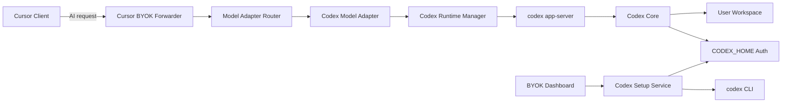
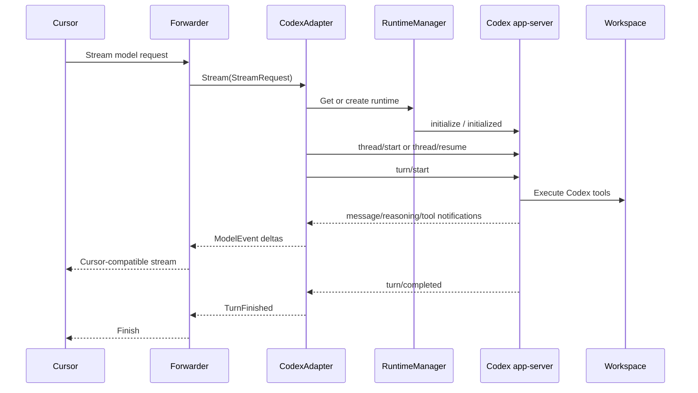
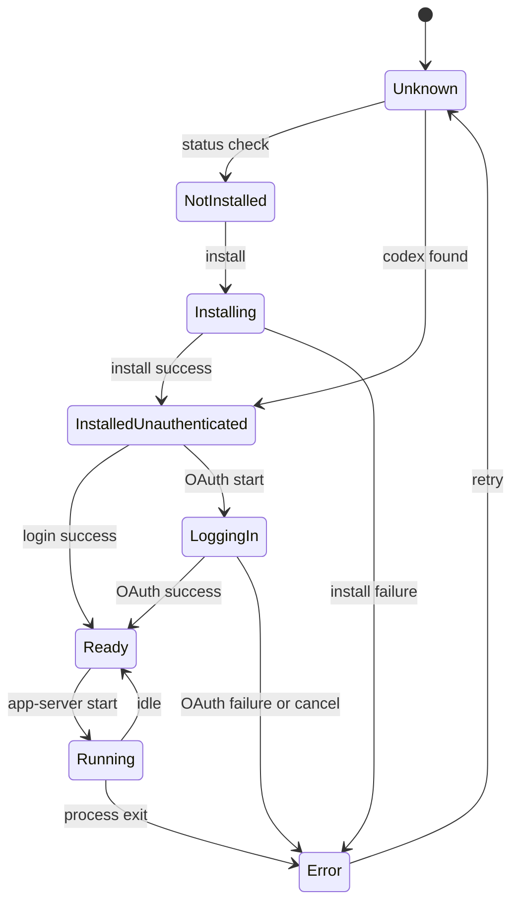
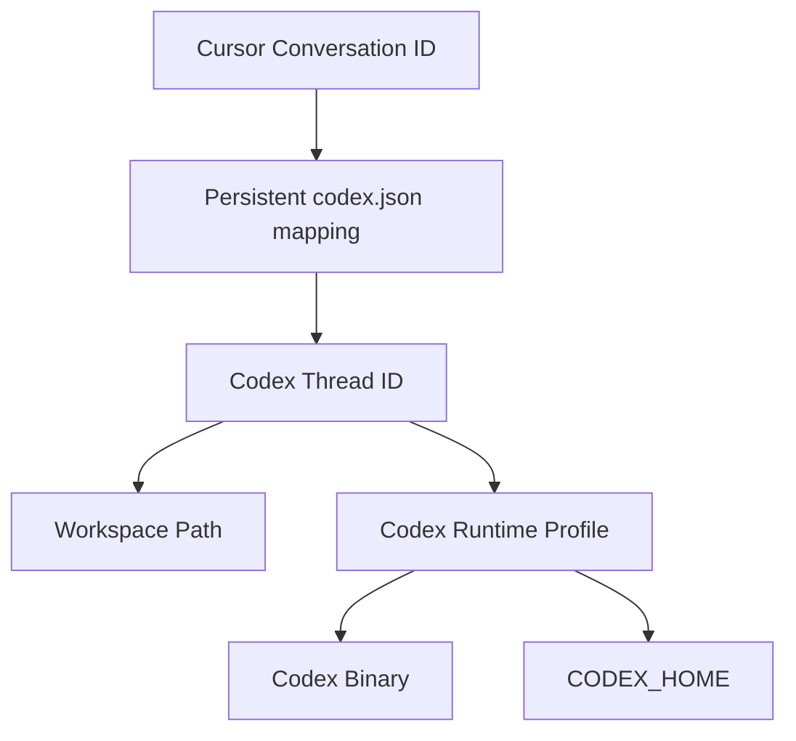
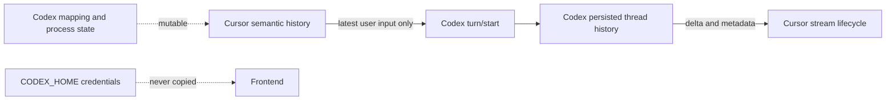
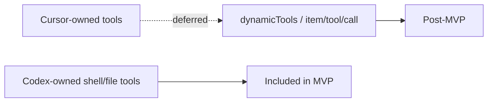

# Codex adapter architecture

## Component diagram

## Request sequence

## Runtime state machine

## Conversation/thread mapping

The mapping is conversation-owned, not global model configuration. Resume is
allowed only when the model and workspace still match. The runtime manager
serializes turns on a single thread and drops late notifications by waiting on
the current thread's completion boundary.

## Data boundaries

`state.json` and `context.json` remain the forwarder's recovery truth for
semantic history and volatile state. `codex.json` is a small mutable adapter
mapping; it is not injected into model-visible prompt history.

## MVP boundary

Codex owns shell/file execution under `workspace-write`. BYOK does not expose
an approval UI in this stage; `approvalPolicy: never` is explicit in runtime
setup, adapter request construction, and the dashboard warning.
